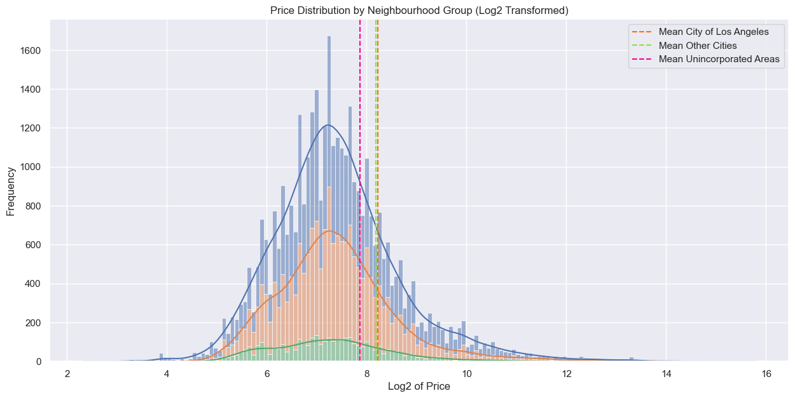
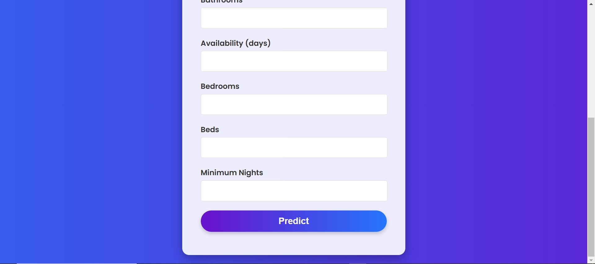

# Predicting Airbnb Property Prices Using Machine Learning
A Machine Learning model built using MLOps principles, complemented with a website to make predictions accessible to users.  

## Project Overview  
This project focuses on predicting house prices using a robust pipeline of machine learning, data science, and visualization techniques. We leveraged MLOps structures for scalability and created an interactive website for users to test the model effortlessly, even without prior knowledge of machine learning or data science.

---

## Data Science and Visualization  

This phase of the project includes comprehensive data preprocessing, exploration, and visualization using Python. It helps derive meaningful insights and informs the model-building process.  

### Features  
- **Data Preprocessing**: Cleaning and transforming data using `pandas`.  
- **Visualization**: Creating detailed and interactive charts with `matplotlib` and `seaborn`.  
- **Support for CSV Input**: Load data files easily for analysis.  
- **Insights Generation**: Analyze metrics and highlight key trends in the dataset.  

### Example Visualizations  
  
> > **Histogram**: Visualizing house prices against neighborhood groups. 

  
> **Barplot and Boxplot**: Displaying room type frequencies.


> **Regplot and Scatterplot**: Exploring house prices with various features like bathrooms.  

---

## MLOps Workflow  

Our pipeline includes:  
- **Data Ingestion & Transformation**: Organizing and processing raw data into usable formats.  
- **Model Training**: Experimenting with different machine learning algorithms to select the best-performing model.  
- **Hyperparameter Tuning**: Optimizing the model for better predictions.  
- **Deployment**: Integrating the model into a website for public use.  

### Website  
We built a user-friendly interface where users can test the model without needing technical expertise.  

  
> **Welcome Page**: A screenshot of the prediction website's homepage.  .


  
> **Prediction Interface**: Screenshot showing the interface for entering inputs and viewing predictions. 

---

## Installation  

Follow these steps to set up the project:  

1. **Clone the Repository**:  
   ```bash
   git clone https://github.com/yourusername/house-prediction-project.git
   ```

2. **Navigate to the Project Directory**:  
   ```bash
   cd house-prediction-project
   ```  

3. **Install Dependencies**:  
   Use `pip` to install the required libraries:  
   ```bash
   pip install -r requirements.txt
   ```  

4. **Run the Application**:  
   Launch the website:  
   ```bash
   python app.py
   ```  

---

## Contributing  
Feel free to fork this repository and submit pull requests. Contributions to improve the model, website, or visualizations are welcome!  

---

## 📬 Connect with Me
- 💼 [LinkedIn](https://www.linkedin.com/in/mohamed-kirate/)
- 📧 Email: [med.kirate@gmail.com](mailto:med.kirate@gmail.com)

